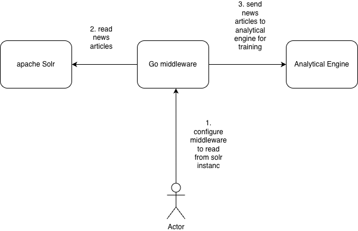
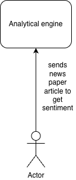

# News articles Sentiment Analysis (Transformer fine-tune)

This small project fine-tunes a pre-trained Transformer for news paper article sentiment analysis using Hugging Face Transformers and Datasets.


Package layout
--------------


Build & install (recommended)
-----------------------------

We recommend using a virtual environment. From the project root:

```bash
cd analysis
python -m venv .venv
source .venv/bin/activate
pip install --upgrade pip setuptools wheel build
pip install -r requirements.txt

# (development) editable install so you can iterate without rebuilding
pip install -e .

# or to produce distributable artifacts (sdist + wheel):
python -m build
pip install dist/*.whl
```


Run the FastAPI server
----------------------

After the editable install (or wheel install), run the server with Uvicorn:

```bash
# using the installed package namespace
uvicorn --app-dir analysis/src analytics_engine.server:app --reload --host 0.0.0.0 --port 8000
```

API endpoints (summary)
-----------------------

- `POST /stream/start` — start the StreamTrainer
- `POST /stream/stop` — stop the StreamTrainer and save the model
- `GET  /stream/status` — returns `{ "running": true|false }`
- `POST /stream/train` — stream JSON payloads for incremental training
- `POST /predictor/start` — load and cache a Predictor from `outputs/` or configured `model_dir`
- `POST /predictor/stop` — unload the cached Predictor
- `POST /predict` — run inference; body: `{ "text": "..." }` or `{ "texts": ["...","..."] }`

Example (curl)
---------------

Start trainer:

```bash
curl -X POST "http://127.0.0.1:8000/stream/start" -H "Accept: application/json"
```

Stream training data (use `--data-binary` to send newline CSV):

```bash
curl -N -X POST "http://127.0.0.1:8000/stream/train" \
  -H "Content-Type: text/plain" \
  --data-binary $'text,label\n"I love this product!",1\n"This is terrible",0\n'
```

Start predictor and predict:

```bash
curl -X POST "http://127.0.0.1:8000/predictor/start"
curl -X POST "http://127.0.0.1:8000/predict" -H "Content-Type: application/json" -d '{"text":"I like it"}'
```


Middleware (Go) API
--------------------

The `middleware/` service (written in Go) exposes HTTP endpoints to register Solr instances, submit jobs, and query or cancel job status. It acts as an orchestration layer and forwards work to the analytics engine (the Python FastAPI service) when appropriate.

- `POST /register_solr` — register a Solr endpoint.
  - Request JSON example:
    ```json
    {
      "base_url": "http://solr-host:8983/solr",
      "collection": "news_collection"
    }
    ```
  - Response example:
    ```json
    { "status": "ok", "id": "solr-1" }
    ```

- `POST /submit_job` — submit a Solr job to be queued and processed.
  - Request JSON example:
    ```json
    {
      "job_id": "job-123",
      "solr": { "base_url": "http://solr-host:8983/solr", "collection": "news_collection" },
      "query": "title:climate",
      "params": { "rows": 100 }
    }
    ```
  - Response example:
    ```json
    { "status": "queued", "queue_id": "q-456" }
    ```

- `GET /get_job_status` — query status for a job (some clients send JSON body containing `job_id`).
  - Request JSON example:
    ```json
    { "job_id": "job-123" }
    ```
  - Response example:
    ```json
    { "job_id": "job-123", "status": "completed", "result": { "processed": 100 } }
    ```

- `POST /cancel_job` — request cancellation of a queued/running job. Depending on implementation cancellation may be a no-op.
  - Request JSON example:
    ```json
    { "job_id": "job-123" }
    ```
  - Response example (when not implemented):
    ```json
    { "status": "not_implemented" }
    ```

How middleware works
------------------

- The middleware enqueues Solr jobs and, when processing, may call the analytics engine endpoints (for example `/stream/start`, `/stream/train`, `/stream/stop`) to perform streaming training or inference.
- Use the middleware endpoints above to register Solr instances and enqueue jobs; monitor job lifecycle with `/get_job_status`.

Design
------

The `design/diagrams.drawio` file contains architecture and sequence diagrams (streaming ingestion → StreamTrainer → ModelTrainer).

extract data using apache nutch and store it in apache solr.


Train the model 



using the model
